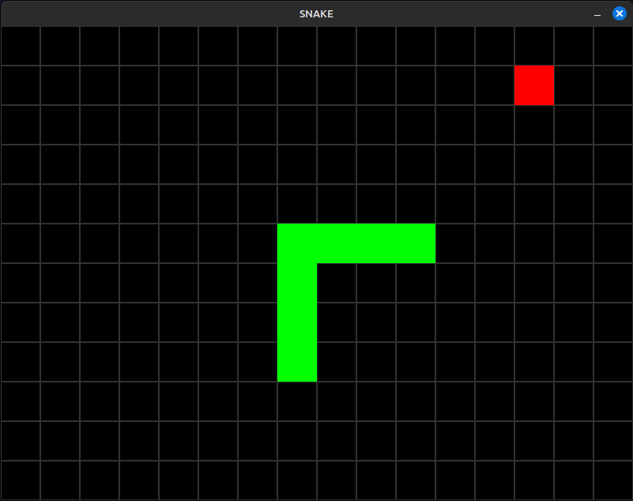

# Snake Game in C

A classic [Snake game](https://en.wikipedia.org/wiki/Snake_(video_game_genre)) implemented in C using the SDL2 library. The player controls a snake that moves around the screen, eats fruits to grow longer, and must avoid colliding with the walls or its own body.

## Features

- **Simple controls**: Arrow keys to control the direction of the snake.
- **Fruit spawning**: Eating fruits makes the snake grow longer.
- **Game over**: The game resets if the snake collides with the walls or its own body.
- **Pause feature**: Press `Space` to pause and resume the game.

## Requirements

- GCC (or any C compiler)
- SDL2 library

## Setup and installation

### [1. Install SDL2 (if not installed)](https://wiki.libsdl.org/SDL2/Installation)

### 2. Clone repository

```bash
git clone https://github.com/guilhermelirar/snake-c.git
cd snake-c
```

### 3. Compile program
```bash
gcc -o Snake main.c src/*.c -I./include -lSDL2
```
### 4. Run
```bash
./Snake
```

## Screenshot


## License
This project is licensed under the MIT License - see the [LICENSE](LICENSE) file for details
